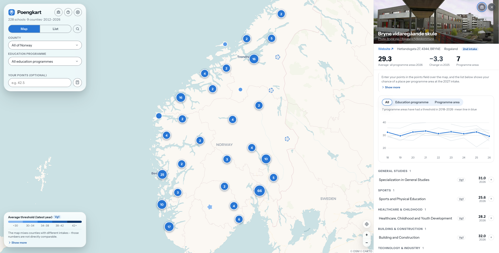
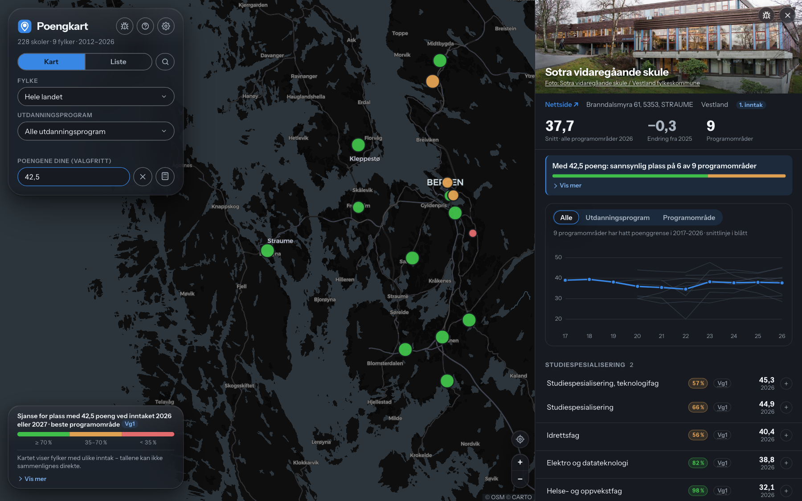

# Poengkart

**https://poengkart-no.vercel.app**

Admission point thresholds (*poenggrenser*) for Norwegian upper secondary
schools, on a map — and as a sortable, rankable list. A threshold is the score
of the last applicant who got a place — a grade average × 10 — so it says what
it took to get in, not what the school requires. 217 schools across the eight
counties that publish these figures, up to fifteen years of history, in
Norwegian and English.





Type in your own points and the map recolours by your chance of a place at
the next intake — green likely, amber possible, red unlikely — per school and
per programme; press + on any programme to collect your wishes (*ønsker*, the
ten a vigo application allows) and see whether the list holds up. Don't know
your points? A small calculator turns vitnemål grades into them. The chance comes from a model fitted on the whole
history and checked by forecasting each past year from the years before it;
the panel says how often that check was right.

The rest of the furniture: search finds any school by name (⌘K or `/`), the
Kart ⇄ Liste toggle swaps the map for a sortable table of the same filtered
figures, every open school is a shareable link (`#s=Fylke/Skolenavn`), a
locate button centres the map on you (the position never leaves the browser),
and settings hold language, light/dark theme, text size and a
colour-blind-friendly palette. [docs/model.md](docs/model.md)
has the model, the backtest and what it cannot know; the
[technical report](docs/technical-report.md) is the formal write-up of the
whole thing — data semantics, model, validation, findings — also published at
[poengkart-no.vercel.app/report](https://poengkart-no.vercel.app/report).

## Run locally

```bash
python3 -m http.server 8742 -d web
```

Then open http://localhost:8742. No build step, no dependencies.

Rebuilding the dataset from the source documents needs the county source
documents, which ship under `sources/` (including the files released under
freedom-of-information requests), and the Python environment in `.venv`:

```bash
.venv/bin/python3 tools/refresh.py
```

One step of that pipeline, the share card, photographs the app's own school
panel and so wants a browser: `pip install playwright` and `playwright install
chromium-headless-shell`. Without one the card still builds, reusing the last
capture in `tools/og-panel.png`.

The same files are mirrored to a public bucket, with every file's SHA-256 in
`sources/manifest.json`; `tools/sources_r2.py fetch` restores a missing
`sources/` from there and verifies each file against the manifest.

## The dataset

`web/data/schools.json` is what the app reads, and is published under the
Norwegian Licence for Open Government Data
([NLOD 2.0](https://data.norge.no/nlod/no/2.0)); the code is MIT. The same
data ships as SQLite and CSV in `data/` for anyone who would rather query it —
`samples` carries every cell with its county, inntak and Grep code, `forecasts` the
model's expected threshold, spread and fill probability per programme, and
`data/model-backtest.csv` every walk-forward forecast the accuracy claims rest
on.

Each (school, programme, year) cell is one of:

| | |
|---|---|
| a number | the threshold — the last admitted applicant's points |
| `0` | the programme filled, but the last admitted had no registered points, so everyone with points got in. The counties print this as its own state, distinct from `open` — Innlandet: *"der det er merket med «0» er det ikke ledige plasser, men siste inntatte har ingen poeng"* |
| `open` | no waitlist; everyone qualified was admitted (**not** zero) |
| `F` | filled on *fortrinnsrett*, a statutory priority right with no threshold |
| `D` | admission by documentation (IB, elite sport), so no threshold exists |
| `U` | the programme was discontinued that year |

Where the figures come from, and which inntak each county publishes. Agder,
Finnmark, Nordland, Telemark, Troms, Vestfold and Østfold do not publish
thresholds; the county select lists them greyed out as *(ingen data)*.

| County | Format | Years | Inntak |
|---|---|---|---|
| [Akershus](https://afk.no/tjenester/skole-og-opplaring/opplaring-i-skole/soke-skoleplass/poenggrenser.222835.aspx) | HTML tables; 2024 and 2026 as Excel, released under an FOI request | 2024–2026 | 1. and 2. (FOI years: 2. only) |
| [Buskerud](https://bfk.no/tjenester/skole-og-opplaring/opplaring-i-skole/soke-skoleplass/) | HTML matrix | 2024–2025 | not stated |
| [Innlandet](https://www.vilbli.no/nb/innlandet/a/poengsum-og-karakterer-6) | PDF matrix; 2020–2022 released under an FOI request | 2020–2026 | 2. |
| Møre og Romsdal | Excel extract from the county's Power BI dashboard, released on request | 2012–2026 | 2. |
| [Oslo](https://www.oslo.kommune.no/skole-og-utdanning/videregaende-skole/soke-videregaende-skole/poengtabeller-for-videregaende-skoler-i-oslo/) | HTML + PDF, oldest years via school-site PDFs | 2017–2026 | 1. |
| [Rogaland](https://www.vilbli.no/nb/rogaland/a/poengsum-og-karakterer-6) | PDF | 2018–2025 | 2. |
| [Trøndelag](https://www.vilbli.no/nb/trondelag/a/poengsum-og-karakterer-6) | PDF, per intake region | 2025 | not stated |
| [Vestland](https://www.vestlandfylke.no/utdanning-og-karriere/elev/soknad-inntak/test-poenggrenser/) | PDF | 2020–2026 | 1. and 3. |
| ↳ Hordaland, pre-merger | PDF press releases, via the Wayback Machine | 2017–2019 | 1. |

Schools come from the national register ([NSR](https://data-nsr.udir.no/)) and
are geocoded through [Kartverket](https://ws.geonorge.no/adresser/v1/) where
the register has no coordinates. Map tiles by [CARTO](https://carto.com/) and
[OpenStreetMap](https://www.openstreetmap.org/).

## Notes

**Inntak are not comparable.** Counties publish different inntak (1., 2. or
3.) and thresholds fall between them, so every figure is labelled with its
inntak and the app warns when a view mixes them.

**Photos** come from [Wikimedia Commons](https://commons.wikimedia.org) under
the licence shown on each image, or from the school's own site, credited to the
school and its county. Every one was looked at before publication: a photo is
used only if it shows that school, and never if pupils are identifiable.
Schools without a suitable photo get a small location map instead. If you hold
the rights to a photo here and would rather it were not used, open an issue.

**Unofficial project.** Figures may contain parsing errors. Check the county's
own pages before making decisions.

More detail, if you want it:

- [docs/data-notes.md](docs/data-notes.md) — which counties publish at all, why
  some have one year and others eight, how the documents are parsed, and what
  was deliberately left unbuilt.
- [docs/programme-categories.md](docs/programme-categories.md) — how programmes
  are sorted into the national *utdanningsprogram*, and what to do when a new
  source brings a name nothing recognises.
