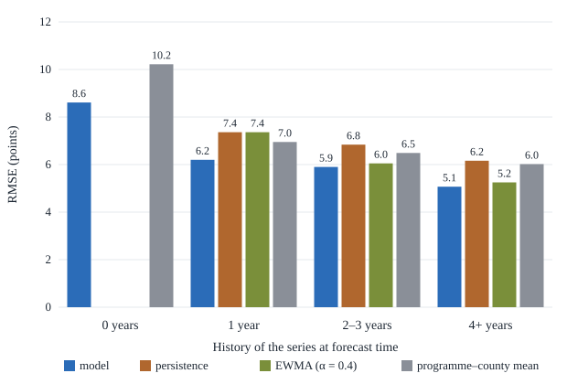
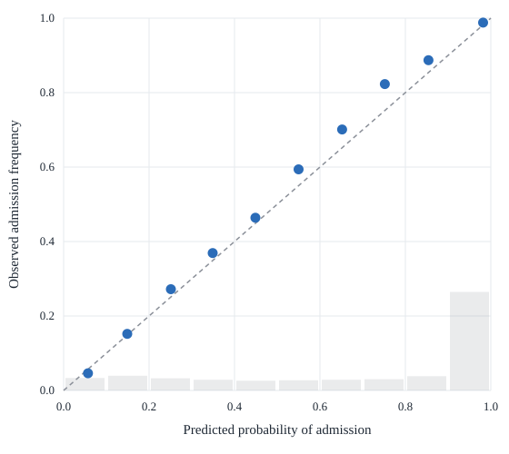

# Poengkart: Open Admission Thresholds and a Calibrated Forecast for the Norwegian Upper-Secondary Intake

**Abshalom Dayan**
Technical report · August 2026 · v1.1 (revised after two independent review passes)
Application: [poengkart-no.vercel.app](https://poengkart-no.vercel.app) · Code and data: [github.com/avshalomd/poengkart](https://github.com/avshalomd/poengkart)

---

## Abstract

Admission to Norwegian upper-secondary school is a centralised, points-based
intake in which roughly 70,000 pupils apply each year, yet its most
decision-relevant statistic — the admission threshold (*poenggrense*), the
points of the last applicant admitted to each programme at each school — is
published by only 7 of 15 intake areas, as PDF tables with inconsistent
structure, retention, and semantics. We assemble all retrievable publications
into an open, register-normalised panel: 191 schools, 2,122 programme rows,
8,663 observations, 2017–2026, keyed to Norway's national programme register
(Grep). On this censored panel we forecast the next intake as the question
families actually ask — the probability of admission given the applicant's
points — using a hurdle model: a hierarchical logistic model for whether a
programme fills, and a hierarchical Gaussian model with a random-walk
county–year level for where the threshold lands if it does. Forecast spread
is estimated from the model's own walk-forward errors rather than taken from
the fit, the error distribution is empirical, and fill probabilities are
recalibrated by Platt scaling. Evaluated walk-forward with 2025–2026 fully
held out, the model beats persistence and group-mean baselines on RMSE and MAE in
every history stratum where they are defined (RMSE 4.99 vs 5.87 on series
with ≥4 observed years), nominal 80% intervals achieve 80.5% empirical
coverage, and the admission probability is both calibrated — observed
frequencies track predictions within five points from 30% upward — and more
accurate than the persistence rule (Brier score 0.094 vs 0.150 on the pairs
where both are defined). Paired within-year
publications additionally identify a systematic intake-round effect of −3.2
to −3.4 points that makes cross-county comparison of raw thresholds
misleading. Code and data are available at
https://github.com/avshalomd/poengkart.

---

## 1. Introduction

In most Norwegian counties, admission to upper-secondary school
(*videregående opplæring*) is a points-based queue. Applicants rank up to ten
programme–school combinations in the national application system (vigo.no),
and each programme admits by descending lower-secondary grade points until
its capacity is reached. The points of the last admitted applicant — the
*poenggrense*, or admission threshold — is a market-clearing cutoff, re-set
every year by that year's cohort. For a family choosing where to apply, the
distribution of plausible thresholds at each candidate programme is the
central planning quantity.

That quantity is public only in fragments. Seven of Norway's fifteen
counties and intake areas publish thresholds at all. Those that do publish
PDF tables that differ in structure, in retention (Oslo's archive reaches
2017; Akershus publishes only the latest year), in which of up to three
intake rounds the figures describe — often without stating which — and in
the notation used for special cases, such as programmes that filled with
applicants who had no points. No national, machine-readable, or historical
compilation exists. Forecasting from such data is hard for structural
reasons: a threshold exists only where demand exceeded capacity, so the
panel is censored by construction; a third of the series have a single
observed year; and the published figure is round-specific, so identical
demand can print different numbers in different counties.

To the best of our knowledge, no prior work addresses forecasting of
admission thresholds in the Norwegian intake, and published work on
threshold forecasting in any centralised score-based admission system is
thin (Section 3). This report describes **Poengkart** ("points map"), an
open dataset, forecasting model, and deployed application. Our contributions
are as follows:

- **An open, register-normalised dataset** of all retrievable published
  thresholds — 191 schools, 2,122 programme rows, 8,663 cell-level
  observations across 7 counties and the years 2017–2026 — in which every
  row is resolved against the national Grep register and every cell's state
  (numeric threshold, filled at zero, no waiting list, quota-based
  admission) is preserved as data (Section 4).
- **A calibrated probabilistic forecast** of the next intake, P(admission |
  applicant's points), from a hurdle model with hierarchical partial pooling
  and a random-walk county–year component, whose predictive spread is
  estimated from walk-forward forecast errors rather than model internals
  (Sections 5–6).
- **A held-out evaluation** on the 2025–2026 intakes showing the model
  dominates persistence and group-mean baselines in every history stratum
  (RMSE 4.99 vs 5.87 and 6.12 in the deepest stratum), with 80.5% empirical
  coverage of nominal 80% intervals and calibrated probabilities (Brier
  0.094 vs 0.150 where both are defined), plus ablations of the structural
  choices (Section 7).
- **Measurements of the publication practice itself**: a paired within-year
  estimate of the intake-round effect (−3.2 to −3.4 points, 16–32% of
  queues cleared between rounds), evidence that raw school means largely
  reflect programme composition rather than demand, and a residual-based
  audit that distinguishes genuine extremes from parsing damage
  (Section 8).

Section 9 describes the deployed application; Sections 10–12 give
limitations, ethical considerations, and recommendations to the publishing
counties.

## 2. Institutional background

Norwegian pupils finish compulsory school with a points total
(*grunnskolepoeng*): ten times the mean of their final grades on the 1–6
scale, a maximum of 60; pupils without grades compete "without points". Applications are submitted through
vigo.no by 1 March: up to **ten ranked wishes**, each a programme at a
school, with at most **three distinct utdanningsprogram** (programmes of
study) among first-year wishes. The programme structure is national,
maintained by the Directorate for Education and Training (Udir) in the
**Grep** register: 15 utdanningsprogram subdivided into 497 *programområder*
(programme areas) across year levels Vg1–Vg3.

Counties run the intake in up to three rounds in July–August. In each round
every programme admits by descending points among remaining applicants;
seats declined in one round are re-offered in the next, so thresholds fall
between rounds (Section 8.1 measures how much). The published threshold is
the points of the last admitted applicant *in the published round* — and
counties differ in which round they publish, sometimes without saying.
Several counties admit within catchment areas, in which case a threshold
binds only residents of the area. Statutory priority admission and admission
on documented grounds bypass the points queue entirely.

Two structural facts shape everything downstream. First, a threshold exists
only where demand exceeded capacity: undersubscribed programmes have no
waiting list and no threshold, so the dataset is **censored by
construction**, and the censoring is informative — it is exactly the "no
queue" event our fill model predicts. Second, the published figure is
**round-specific**: comparing thresholds across counties without knowing the
round conflates market differences with administrative timing.

## 3. Related work

**School choice and matching markets.** Centralised admission mechanisms
descend from deferred acceptance (Gale & Shapley, 1962); their analysis and
design as school-choice mechanisms is a mature literature (Abdulkadiroğlu &
Sönmez, 2003). In large score-priority markets, stable outcomes are
characterised by market-clearing cutoffs (Azevedo & Leshno, 2016) — the very
object we forecast — and cutoffs figure as sufficient statistics in
empirical work on centralised admission (Fack, Grenet & He, 2019). This
literature designs and analyses mechanisms; it does not forecast next year's
cutoffs for applicants.

**Cutoff prediction.** Direct prior art is thin. The closest published work
we know of predicts admission score lines in China's Gaokao system (Chen,
Peng, Gao & Cai, 2022). Our setting differs in scale and structure — many
small county-level queues with short histories rather than one national
exam — which motivates partial pooling and makes calibrated probabilities,
not point predictions, the deliverable.

**Hierarchical models and shrinkage.** Borrowing strength across small
groups by partial pooling is classical (James & Stein, 1961; Efron & Morris,
1975) and is standard multilevel practice (Gelman & Hill, 2007). We apply it
to a censored panel in which 567 of 1,670 series have a single observation,
with variance components estimated by an EM-type procedure (Dempster, Laird
& Rubin, 1977).

**Censored and two-part models.** Treating "no queue formed" as censoring of
a latent threshold descends from Tobin (1958); we instead use a two-part
hurdle specification (Cragg, 1971), because the fill event is observed and
economically distinct from the threshold's level, and because the
application needs the fill probability as its own output.

**Calibration and forecast evaluation.** Post-hoc recalibration by a fitted
logistic map is Platt scaling (Platt, 1999; Niculescu-Mizil & Caruana,
2005; Guo, Pleiss, Sun & Weinberger, 2017). Probabilities are scored with
the Brier score (Brier, 1950), a strictly proper scoring rule (Gneiting &
Raftery, 2007), and reliability diagrams (DeGroot & Fienberg, 1983; Murphy,
1973); interval forecasts are judged by the calibration-and-sharpness
criterion (Gneiting, Balabdaoui & Raftery, 2007). Our temporal evaluation
follows rolling-origin practice (Tashman, 2000; Bergmeir & Benítez, 2012;
Hyndman & Athanasopoulos, 2021).

## 4. Data

### 4.1 Sources and extraction

The sources are the counties' own publications — typically one PDF per
county per year, occasionally per intake round. Each county has a dedicated
extractor feeding a shared normaliser. PDFs are read by coordinate rather
than by text flow: columns are sliced by x-position, and rotated column
headers (Oslo, Vestland) are reconstructed glyph by glyph. Editions that
counties overwrote or removed were recovered from the Internet Archive.
School names are matched to the national school register (NSR) within
county and geocoded via NSR, the national address API, and the national
place-name register, in that order. Where two publications disagree on a
cell, the newer wins and the disagreement is retained in
`data/source-drift.json`; a disagreement near a full grade point flags the
school-year as uncertain, and the application says so in words. A suite of
73 regression checks locks known failure modes: shifted year columns,
implausible values, unmatched schools, county-specific quirks.

### 4.2 Register normalisation

Programme labels vary in spelling across counties and across years within a
county. Every row is resolved against Grep: 2,116 of 2,122 rows carry a
register code (the remaining six are International Baccalaureate, outside
the register). The classification into utdanningsprogram is therefore the
state's own, not ours — an earlier keyword classifier misfiled
*gartnernæring* (horticulture) under restaurant and food processing because
the substring "ernæring" (nutrition) matched. County intake groups are finer
than Grep codes (one school can run several queues under one code), so each
row keeps the county's own label as its identity and carries the register
code and official name as metadata.

### 4.3 Cell semantics

A cell in a county table is not always a number, and the non-numbers are
distinct events, not missing data. Table 1 gives the taxonomy and how each
state enters the analysis.

**Table 1:** Cell states in county publications and their treatment. "Level"
and "fill" refer to the two model components of Section 5.

| Cell | Meaning | In averages? | In the model? |
|---|---|---|---|
| e.g. 38.4 | Waiting list; last admitted had 38.4 points | yes | level + filled |
| 0.0 | Filled, but last admitted competed without points | **no** | filled, never level |
| "all admitted" | No waiting list; no threshold exists | no | not filled |
| F / D / U | Priority quota / documented grounds / discontinued | no | outside both parts |

Two consequences are enforced throughout. The dataset is censored by
construction, so averages of published numbers are averages over the queued
subset, and the fill indicator carries the rest of the signal. And 0.0 is a
trap: it prints like a number but is the bottom of the scale, not a height
on it — including it in a mean drags a school's level toward zero for the
opposite reason a genuinely low threshold does.

### 4.4 Coverage

The panel spans 2017–2026: Oslo 2017–2026, Vestland 2017–2026
(2017–2019 as a narrower Bergen-area series), Rogaland 2018–2025, Innlandet
2023–2025, Buskerud 2024–2025, and Akershus and Trøndelag 2025 only. Of the
1,670 school×programme series, 567 have exactly one observed year. Among the
8,663 cells, 7,934 competed on points (and thus inform the fill model) and
5,433 carry a numeric threshold (and thus inform the level model). The
non-publishing intake areas either state that they choose not to publish
(Agder, Nordland, Østfold), publish aggregate statistics without thresholds,
or publish behind a dashboard (Møre og Romsdal). The unevenness is a
property of the publication regime, not of the collection: for several
counties and periods, county-wide thresholds were never computed, because
admission ran on catchment rather than points.

## 5. Forecasting model

### 5.1 Notation and target

A **series** $i$ is one school×programme×level queue; $sc[i]$, $p[i]$,
$a[i]$, and $c[i]$ denote its school, utdanningsprogram, programme area, and
county, and $r(i,t)$ the intake round its county published in year $t$. In
year $t$, $Q_{it} \in \{0, 1\}$ indicates that the cell filled (a queue
formed), and $y_{it}$ is the published threshold, observed only when
$Q_{it} = 1$ and the last admitted applicant had points ($y > 0$). For an applicant
with points $x$, the deployed quantity for the county's next publication
year is

$$P(\text{place} \mid x) \;=\; (1 - \pi) \;+\; \pi \, \Phi_F\!\left(\frac{x - m}{s}\right), \tag{1}$$

where $\pi$ is the forecast probability that a queue forms, $m$ the forecast
threshold conditional on a queue, $s$ the forecast spread (Section 6.1), and
$\Phi_F$ the CDF of the standardised forecast error (Section 6.2). Equation
(1) is the hurdle decomposition: either no one is turned away, or admission
requires the cutoff to land at or below $x$. One state sits outside the
decomposition: a cell that fills with the last admitted applicant holding no
points (the 0.0 state of Table 1) counts as $Q = 1$ but contributes no $y$ —
admission there is certain at any score, and the calibration in Section 7.4
scores it as such; the empirical recalibration of $\pi$ absorbs the
approximation.

### 5.2 Two components, one hierarchy

The **level** component models the observed thresholds:

$$y_{it} \mid Q_{it} = 1,\, y_{it} > 0 \;\sim\; \mathcal{N}\!\left(\mu + \alpha_{sc[i]} + \beta_{p[i]} + \gamma_{a[i]} + u_i + w_{c[i],t} + \rho_{r(i,t)},\; \sigma^2\right), \tag{2}$$

and the **fill** component the queue-formation event:

$$\operatorname{logit} P(Q_{it} = 1) \;=\; \nu + \alpha'_{sc[i]} + \beta'_{p[i]} + \gamma'_{a[i]} + u'_i + w'_{c[i],t} + \rho'_{r(i,t)}. \tag{3}$$

$\mu$ and $\nu$ are intercepts. Four terms are random effects with
mean-zero Gaussian priors and estimated variances: school ($\alpha$),
programme area within level ($\gamma$), the series interaction $u_i$ (a
school can be strong in music and ordinary in electrical), and the
county–year effect $w$. The utdanningsprogram effect $\beta$ is an
(essentially unpenalised) fixed effect — with only 16 levels it needs no
pooling — and the round terms $\rho$ are fixed too: in the fill model an
unpenalised round-3 indicator, and in the level model a plug-in constant
taken from the round bridge rather than an estimated coefficient
(Section 5.4). The county–year effect follows a random walk,

$$w_{c,t} \;=\; w_{c,t-1} + \eta_{c,t}, \qquad \eta_{c,t} \sim \mathcal{N}(0, \tau_w^2), \tag{4}$$

so a county's market level moves smoothly and its latest state is the
forecast for next year; an innovation spans two *consecutive published*
years, so a publication gap is one step, not one step per calendar year.
The level component is fitted on the 5,433 cells with a numeric threshold;
the fill component on all 7,934 cells that competed on points. The hierarchy exists to borrow strength: a series with
one observed year inherits its level from the hundreds of comparable series
around it — partially pooled toward its school, programme, and county means
— instead of being trusted alone.

### 5.3 Estimation

Effects are estimated by penalised maximum likelihood, with variance
components updated by a few rounds of the standard normal–normal EM
approximation (each component is floored at 0.3 points, and the random-walk
levels carry a small ridge for identifiability); the pipeline is
deterministic. Observations are
exponentially down-weighted with age; the half-life of 4 years was selected
by the backtest and mattered little (Section 7.5). Table 2 reports the
fitted standard deviations.

**Table 2:** Fitted variance components (standard deviations) of the four
random-effect families. Level components in points; fill components on the
logit scale. The fixed effects ($\mu$, $\nu$, $\beta$, $\rho$) have no
variance component.

| Component | Level (points) | Fill (logit) |
|---|---|---|
| School | 3.4 | 1.3 |
| Programme area (within level) | 3.1 | 1.4 |
| Series (school×programme) | 2.7 | 1.7 |
| County–year innovation | 1.3 | 0.9 |
| Residual | 4.5 | — |

Coupling the components — the level model's school effect as an offset in
the fill model, so "in demand" is one trait read two ways — was tried and
rejected by the backtest (Section 7.5).

### 5.4 Rounds

Within a county the published round is constant, so it is absorbed by the
county level and need not be known — which is why counties that do not state
their round remain usable. The one exception in the data, Vestland 2023
(published from round 3 inside a round-1 series), is handled with fixed
per-programme offsets taken from the round bridge (Section 8.1), so the
random walk does not read an administrative dip as a market event. These
offsets enter the level model as known constants — $\rho$ in (2) is not
estimated — and the affected cells are also excluded from evaluation
(Section 7.1).

## 6. Uncertainty

### 6.1 Spread from walk-forward errors, not from the fit

A hierarchical model is sure of itself: the residual standard deviation is
4.5 points, but a next-year forecast also carries the uncertainty of every
borrowed effect and of the market's next move — and for a one-year series
the effects are mostly borrowed. The spread $s$ in (1) is therefore not read
from the final fit. It is the RMSE of the model's own walk-forward
forecasts on the calibration years (Section 7.1), stratified by the history
the series had at forecast time, and floored at the residual sd of the
newest fit that saw no evaluation year (4.4 points, from the fit trained on
data through 2024), so a spread can never claim to beat the model's own
in-sample noise (Table 3). An earlier version floored at the final fit's
residual instead — a small leak of the held-out years into their own
intervals, worth 0.4 points of coverage; both review passes flagged it, and
the floor now uses only pre-evaluation data.

**Table 3:** Forecast spread $s$, estimated from walk-forward errors on the
calibration years 2020–2024.

| History at forecast time | $s$ (points) |
|---|---|
| 0 years | 7.2 |
| 1 year | 6.4 |
| 2–3 years | 5.6 |
| 4+ years | 4.4 |

The gradient is the empirical price of borrowing: a never-observed series is
forecast 7.2 points loose; four observed years buy the spread down to 4.4.

### 6.2 An empirical error distribution

$\Phi_F$ in (1) is the empirical CDF of the standardised walk-forward errors
(41 quantiles), not a Gaussian. It is mildly left-skewed — thresholds
collapse more often than they jump, because a queue can vanish but cannot
exceed its applicant pool — though on this data a Gaussian would have scored
almost identically. The empirical CDF is clamped to [0.005, 0.995], so no
single cell's probability is ever exactly $1 - \pi$ or 1.

### 6.3 Recalibrating the fill probability

The raw fill model is overconfident: in the calibration-year walk-forwards,
cells given $\pi = 0.97$ filled 82% of the time — the series effects fit the
training panel too well.
We therefore recalibrate by Platt scaling, fitting

$$\operatorname{logit} \pi' \;=\; -0.124 \;+\; 0.465 \, \operatorname{logit} \pi \tag{5}$$

on the calibration years only, which are disjoint from the held-out
evaluation years. The slope well below 1 is a uniform confidence haircut.
Held-out Brier for the fill event: 0.163 against 0.204 for the base-rate
forecaster (base rate 0.714). The full reliability table is in Appendix C;
the recalibrated $\pi'$ still wobbles in the sparse mid-range bins (72%
observed in the 50–60% bin), which the deployed quantity (1) — the only
probability shown to users — absorbs, as Section 7.4 shows.

## 7. Evaluation

### 7.1 Protocol

Evaluation is walk-forward with an expanding window (Tashman, 2000; Bergmeir
& Benítez, 2012): for each target year $t \in \{2020, \dots, 2026\}$, the
model is fitted on everything published before $t$ and forecasts year $t$.
Years 2020–2024 are **calibration years**: they set $s$ (Section 6.1),
$\Phi_F$ (Section 6.2), and the Platt map (5). Years **2025–2026 are held
out entirely** and are the only years reported in this section. For the
held-out years, no information from 2025 onward touches the forecasts:
model fits, spread, error distribution, Platt map, and the half-life were
all fixed on earlier data. (Within the calibration years the selection is
pooled across 2020–2024, as calibration always is.) One caveat survives:
the round bridge of Section 8.1 is computed once on all paired
publications, including 2025–2026, and its offsets enter each training fit
only for the Vestland 2023 cells — cells that are themselves excluded from
all scoring (464 competed cells, 218 with a numeric threshold), so the
contamination is confined to a second-order training detail. The exclusion
itself is principled: no earlier year can teach any forecaster that
administrative event, and grading the model on an offset it is told about
would mislead in both directions.

Two baselines: **persistence** — the series' most recent published figure,
at whatever lag — where the series has history, and the **programme–county
mean** of prior years.

### 7.2 Threshold accuracy

**Table 4:** Held-out threshold accuracy, 2025–2026 (1,497 cells with a
published number), by history stratum. RMSE and MAE in points (↓ better);
±3 is the share of forecasts within three points (higher better); best per
row in bold. Persistence is undefined for 0-year series.

| History | n | Model RMSE | Persistence RMSE | Prog–county mean RMSE | Model MAE | Persistence MAE | Model ±3 | Persistence ±3 |
|---|---|---|---|---|---|---|---|---|
| 0 years | 269 | **7.35** | — | 8.09 | **5.69** | — | **34%** | — |
| 1 year | 169 | **5.83** | 7.65 | 6.77 | **4.57** | 5.74 | 41% | 41% |
| 2–3 years | 350 | **5.63** | 7.11 | 6.50 | **4.42** | 5.28 | **42%** | 40% |
| 4+ years | 709 | **4.99** | 5.87 | 6.12 | **3.71** | 4.12 | 52% | **55%** |

The model beats both baselines on RMSE and MAE in every stratum where they
are defined (Figure 1). The ±3 hit rate tells a subtler story: persistence
ties it at one year of history and wins it in the deepest stratum (55% vs
52%) — repeating the last figure lands inside a narrow band slightly more
often, and misses by more when it misses, which is the trade a
squared-error forecast makes. Overall: RMSE 5.72, MAE 4.33, 45% of
forecasts within ±3 points. For scale, the same series moves with a
standard deviation of 6.2 points between consecutive published years
(3,298 pairs; 51% of moves within ±3), so persistence is a strong baseline
and the residual year effect is large — which is why the deliverable is the
distribution, not the point forecast. Per-year results are in Appendix B.

**Figure 1:** Held-out RMSE by history stratum: model against both
baselines.

### 7.3 Interval coverage

The nominal 80% interval $m \pm 1.2816\,s$ contained the published figure
**80.5%** of the time on held-out cells (n = 1,497, so the binomial
standard error is about one point, and larger under county–year
clustering), at a mean width of 13.8 points. Coverage is the target and
width the price (Gneiting, Balabdaoui & Raftery, 2007): roughly ±7 points
is what an honest 80% claim costs on this data. The graded interval is the
symmetric Gaussian one because that is what the application displays; the
deployed error distribution $\Phi_F$ is mildly skewed, and coverage is
conditional on a numeric threshold materialising at all.

### 7.4 Admission-probability calibration

The deployed quantity is (1). For every held-out cell and every score $x \in
\{20, 25, \dots, 55\}$ we ask "would an applicant with $x$ points have been
admitted?" — the outcome is determined by the published threshold and fill
state — and score the predicted probability over all 16,976 score–cell
pairs: Brier score **0.097**. The persistence rule ("the most recent
published threshold is this year's", a step function in $x$) is defined
only where the series has a prior figure, 12,360 of those pairs; on that
common subset the model scores **0.094** against the rule's **0.150**.

**Table 5:** Reliability of the held-out admission probability (Figure 2
shows the same data as a diagram).

| Predicted | Observed | n |
|---|---|---|
| 0–10% | 3.1% | 588 |
| 10–20% | 9.2% | 1,138 |
| 20–30% | 22% | 1,305 |
| 30–40% | 37% | 1,199 |
| 40–50% | 41% | 797 |
| 50–60% | 56% | 877 |
| 60–70% | 62% | 761 |
| 70–80% | 77% | 1,021 |
| 80–90% | 87% | 1,182 |
| 90–100% | 98.4% | 8,108 |

From 30% upward the forecast tracks observed frequency within five points.
Below 30% it is optimistic — a stated 15% was realised at about 9% — a
region the application's coarse bands (likely ≥ 70%, possible ≥ 35%,
otherwise unlikely) absorb, and which we document wherever the raw percentage is
shown.

**Figure 2:** Reliability diagram of the held-out admission probability.
Grey bars show where the predictions' mass sits (55% of score–cell pairs
land above 80%).

### 7.5 Ablations

Both structural choices that could have gone the other way were adjudicated
on the calibration years, never the held-out years:

- **Recency half-life.** Over half-lives {1.5, 2.5, 4, ∞} years the
  calibration-year walk-forward RMSE was {6.228, 6.206, 6.199, 6.205}: 4
  years wins — kept because it wins, reported because it barely does.
- **Level→fill coupling.** Plugging the level model's school effect into the
  fill model raised fill log-loss from 0.403 to 0.406; the fill model's own
  school effect already carries the information. The components stay
  independent.

## 8. Findings about the publication practice

### 8.1 The intake-round effect

Two counties publish the same programmes in the same year from two rounds —
a paired, within-year measurement of what a later round does (Table 6).

**Table 6:** The round bridge: paired within-year threshold changes between
published rounds.

| | Pairs queued in both | Later − earlier (points) | Queues cleared by later round |
|---|---|---|---|
| Akershus, round 1 → 2 | 101 | −3.4 (sd 3.1) | 16% of 124 |
| Vestland, round 1 → 3 | 910 | −3.2 (sd 3.8) | 32% of 1,348 |

The drop conditional on the queue surviving is half the story; the cleared
queues are the other half. The effect is heterogeneous by programme —
in Vestland, *studiespesialisering* −5.3 and *påbygging* −5.9 against
electrical −1.7 and building −2.6 (full table in Appendix A). Cross-county
comparison of raw thresholds that ignores the round is therefore
systematically misleading by 3–6 points — and several counties do not state
the round in their publication. We deliberately do not project a common
"round-1 equivalent" scale across counties: applying Akershus's offsets to
Rogaland would be an assumption dressed as a measurement.

### 8.2 Raw school means largely measure programme mix

The school effect $\alpha_s$ in (2) is a school's threshold level relative
to the same programmes elsewhere in its county — programme mix held
constant. Re-ranking the 137 schools with five or more published thresholds
by $\alpha_s$ instead of by raw mean moves the average school 16 places and
the most extreme school 65. A substantial part of a raw school mean is what
the school *offers*, not how contested it is. The application prints the
mix-adjusted effect with a standard error and states that it measures
demand, not quality.

### 8.3 The model as a data audit

The cells the fitted model finds least plausible ($|z| > 3$: 54 of 5,433,
of which the 25 most extreme are published in the model metadata) were
checked against sources. The
three largest deviations (Vestland 2022) appear verbatim in the county's own
PDF — genuine extremes, not parse damage; one case remains open. Residual
screening of this kind is a continuous quality control of both pipeline and
source, and would catch the header-shift class of parser bug if it recurred.

## 9. The deployed application

The map colours each school by the mean of its current-year thresholds and
sizes each marker by the share of its programmes that filled — the censoring
is displayed, not hidden inside the mean. One global filter follows the
register's hierarchy (all → utdanningsprogram → programområde), with county
row labels preserved as queue identities and official register names
attached where spellings diverge. With the applicant's points entered, every
row shows the probability (1); a choice list enforces vigo's real
constraints — ten wishes, at most three distinct Vg1 utdanningsprogram — and
reports the probability of at least one place as $1 - \prod_k (1 - p_k)$
under an explicit independence caveat. Where a county publishes round 1 but
admits through round 3 (Vestland), the application also shows the chance by
the final round,

$$P(\text{place by round 3}) \;=\; (1 - \pi) + \pi \left( v_p + (1 - v_p)\, \Phi_F\!\left(\frac{x - m - \delta_p}{s}\right) \right), \tag{6}$$

with $v_p$ the share of round-1 queues cleared by round 3 and $\delta_p$ the
surviving-queue drop, both per programme from Section 8.1. The interface is
bilingual (Norwegian/English), phrased in the official Udir/vigo vocabulary
throughout, and the full dataset is downloadable from the page.

## 10. Limitations

- **Marginal, not individual.** The model forecasts the queue's cutoff, not
  an individual's outcome. It ignores that applicants compete only at their
  highest surviving wish, tie-breaking, and seats consumed by priority and
  documentation quotas.
- **Stationarity.** The random walk extrapolates a smoothly moving market.
  Capacity changes, new schools, catchment redistricting, and reputation
  shocks are structurally unforecastable from thresholds alone; the model
  will be wrong at exactly the discontinuities families most want warned
  about, and the spread $s$ prices this only on average.
- **The published number, in the published round.** Where a county publishes
  round 1, more applicants are ultimately admitted than the figure implies;
  Section 8.1 measures the gap where it can be measured, and equation (6)
  passes it on only for the county where it is measured.
- **Short test window.** Two held-out years (1,497 cells) from one country.
  We report per-year results (Appendix B) rather than standard errors over
  years; 2026 looks better than 2025 partly because its cells are drawn
  from the counties with the deepest histories.
- **Independence in the choice list.** The at-least-one probability treats
  wishes as independent; a hard year hits several of them at once, so the
  true probability is somewhat lower.
- **Catchment counties.** A threshold binds only residents of the intake
  area; the application states this where it applies.
- **Self-selected counties.** The seven publishing counties chose to
  publish; nothing here is evidence about the eight that do not, and any
  future expansion inherits whatever made them different.
- **Regime changes.** A programme can move between the points queue and the
  quota states (F/D/U) between years; the hurdle predicts queue formation,
  not that kind of administrative transition.
- **Low-probability optimism.** Below 30%, the raw probability is a few
  points optimistic (Section 7.4).
- **Reflexivity.** A public forecast can move where people apply, which
  moves the thresholds being forecast — a Goodhart-type feedback. At the
  current scale we judge this unmeasurable, but it is the reason the
  application shows bands and history rather than a single authoritative
  number, and the effect would first appear as a calibration drift in
  precisely the walk-forward record this report is built on.

## 11. Ethical considerations

The unit of analysis is the queue, never the applicant: the data contain no
personal information — only the per-programme cutoffs counties already
publish — and the application collects none; points entered by a user stay
in the browser. The tool informs applicants; it does not gatekeep, rank, or
score any person, and it must not be used by institutions for admission
decisions. Miscalibration harms are asymmetric — an overconfident "you will
get in" can cost a pupil their safety choice — which is why the fill
probability is deliberately recalibrated downward (Section 6.3), why coarse
bands absorb the optimistic low tail, and why every forecast is shown next
to the threshold's actual history. The mitigation itself has a cost: a
conservative "unlikely" can deter an application that would have succeeded,
and for a pupil that chilling effect is as real as the false promise — the
history shown beside every forecast, and the round-3 chance where it is
measured, exist to let a family see past the band. The interface is
Norwegian and English only; families most disadvantaged by the current
PDF-fragmented practice include those reading neither, and closing that gap
is distribution work the tool has not yet done. Raw school means are not presented as
rankings, and the mix-adjusted school effect is labelled a measure of
demand, not quality. Finally, information tools tend to benefit the already
informed; publishing the compiled dataset and the tool free of charge is an
attempt to level an asymmetry that today favours families with the
resources to collect and interpret seven counties' PDFs by hand.

## 12. Recommendations to publishers

Each of these is cheap, and each would have removed an entire error class
from this work:

1. **Publish machine-readable tables** (CSV/JSON) alongside the PDF.
2. **State the intake round in the table** — it moves the numbers by 3–6
   points and is today often omitted.
3. **Standardise cell semantics**: distinguish "filled at 0.0", "all
   admitted", and quota/documentation admissions explicitly.
4. **Print Grep codes** — programme names are today spelled differently
   across counties and across years within a county.
5. **Publish history, not only the latest year** — the uncertainty in any
   advice to a family cannot be quantified without it.

## 13. Conclusion

A censored panel of published cutoffs, a hurdle model with partial pooling,
and uncertainty measured from the model's own out-of-sample record turn
seven counties' PDFs into a calibrated answer to the question families
actually ask. The same assembly measures the publication practice it
depends on: the intake-round effect, the mix-versus-demand decomposition of
school averages, and the residual audit are of more lasting interest than
any single year's forecast — and each points to a concrete, low-cost
improvement the publishing counties could make.

## Reproducibility statement

All code for data extraction, normalisation, model fitting, evaluation, and
the figures in this report is available at
[github.com/avshalomd/poengkart](https://github.com/avshalomd/poengkart);
the version this report describes is tagged `report-v1.1`. The cleaned
dataset ships in the repository and is downloadable from the application;
the original county publications are linked from the documentation rather
than mirrored. `tools/refresh.py` regenerates the dataset, the model, every
walk-forward forecast with its outcome (`data/model-backtest.csv`), and
every number in this report from the sources; `tools/report_figures.py`
regenerates the figures. The pipeline is deterministic — there is no seed to
vary — and runs in minutes on a laptop. Validation comprises 73 parser
regression checks, 12,959 model invariants, and 13 UI invariants executed in
the application itself.

## References

- Abdulkadiroğlu, A., & Sönmez, T. (2003). School choice: A mechanism design
  approach. *American Economic Review*, 93(3), 729–747.
- Azevedo, E. M., & Leshno, J. D. (2016). A supply and demand framework for
  two-sided matching markets. *Journal of Political Economy*, 124(5),
  1235–1268.
- Bergmeir, C., & Benítez, J. M. (2012). On the use of cross-validation for
  time series predictor evaluation. *Information Sciences*, 191, 192–213.
- Brier, G. W. (1950). Verification of forecasts expressed in terms of
  probability. *Monthly Weather Review*, 78(1), 1–3.
- Chen, X., Peng, Y., Gao, Y., & Cai, S. (2022). A competition model for
  prediction of admission scores of colleges and universities in Chinese
  college entrance examination. *PLOS ONE*, 17(10), e0274221.
- Cragg, J. G. (1971). Some statistical models for limited dependent
  variables with application to the demand for durable goods.
  *Econometrica*, 39(5), 829–844.
- DeGroot, M. H., & Fienberg, S. E. (1983). The comparison and evaluation of
  forecasters. *Journal of the Royal Statistical Society, Series D*, 32,
  12–22.
- Dempster, A. P., Laird, N. M., & Rubin, D. B. (1977). Maximum likelihood
  from incomplete data via the EM algorithm. *Journal of the Royal
  Statistical Society, Series B*, 39(1), 1–38.
- Efron, B., & Morris, C. (1975). Data analysis using Stein's estimator and
  its generalizations. *Journal of the American Statistical Association*,
  70(350), 311–319.
- Fack, G., Grenet, J., & He, Y. (2019). Beyond truth-telling: Preference
  estimation with centralized school choice and college admissions.
  *American Economic Review*, 109(4), 1486–1529.
- Gale, D., & Shapley, L. S. (1962). College admissions and the stability of
  marriage. *The American Mathematical Monthly*, 69(1), 9–15.
- Gelman, A., & Hill, J. (2007). *Data Analysis Using Regression and
  Multilevel/Hierarchical Models*. Cambridge University Press.
- Gneiting, T., Balabdaoui, F., & Raftery, A. E. (2007). Probabilistic
  forecasts, calibration and sharpness. *Journal of the Royal Statistical
  Society, Series B*, 69(2), 243–268.
- Gneiting, T., & Raftery, A. E. (2007). Strictly proper scoring rules,
  prediction, and estimation. *Journal of the American Statistical
  Association*, 102(477), 359–378.
- Guo, C., Pleiss, G., Sun, Y., & Weinberger, K. Q. (2017). On calibration
  of modern neural networks. *Proceedings of the 34th International
  Conference on Machine Learning* (PMLR 70).
- Hyndman, R. J., & Athanasopoulos, G. (2021). *Forecasting: Principles and
  Practice* (3rd ed.). OTexts.
- James, W., & Stein, C. (1961). Estimation with quadratic loss.
  *Proceedings of the Fourth Berkeley Symposium on Mathematical Statistics
  and Probability*, Vol. 1, 361–379.
- Murphy, A. H. (1973). A new vector partition of the probability score.
  *Journal of Applied Meteorology*, 12(4), 595–600.
- Niculescu-Mizil, A., & Caruana, R. (2005). Predicting good probabilities
  with supervised learning. *Proceedings of the 22nd International
  Conference on Machine Learning*.
- Platt, J. C. (1999). Probabilistic outputs for support vector machines
  and comparisons to regularized likelihood methods. In *Advances in Large
  Margin Classifiers*. MIT Press.
- Tashman, L. J. (2000). Out-of-sample tests of forecasting accuracy: An
  analysis and review. *International Journal of Forecasting*, 16(4),
  437–450.
- Tobin, J. (1958). Estimation of relationships for limited dependent
  variables. *Econometrica*, 26(1), 24–36.

## Appendix A: The round bridge by programme (Vestland, round 1 → 3)

**Table A1:** Paired within-year threshold change from round 1 to round 3 in
Vestland, by utdanningsprogram; sorted by the size of the drop. "Queues
cleared" counts round-1 queues that no longer existed in round 3.

| Utdanningsprogram | Pairs | Later − earlier | Queues cleared |
|---|---|---|---|
| Påbygging til generell studiekompetanse | 56 | −5.9 | 20% of 70 |
| Datateknologi og elektronikk | 7 | −5.8 | 30% of 10 |
| Studiespesialisering | 64 | −5.3 | 41% of 109 |
| Medier og kommunikasjon | 9 | −4.7 | 47% of 17 |
| Salg, service og reiseliv | 41 | −4.5 | 33% of 61 |
| Kunst, design og arkitektur | 14 | −4.2 | 18% of 17 |
| Informasjonsteknologi og medieproduksjon | 11 | −4.1 | 62% of 29 |
| Helse- og oppvekstfag | 167 | −3.4 | 28% of 231 |
| Naturbruk | 55 | −3.2 | 39% of 90 |
| Frisør, blomster, interiør og eksponeringsdesign | 16 | −3.0 | 50% of 32 |
| Idrettsfag | 19 | −2.9 | 41% of 32 |
| Bygg- og anleggsteknikk | 93 | −2.6 | 37% of 150 |
| Restaurant- og matfag | 18 | −2.6 | 60% of 47 |
| Teknologi- og industrifag | 165 | −2.5 | 30% of 236 |
| Musikk, dans og drama | 18 | −2.1 | 42% of 31 |
| Elektro og datateknologi | 157 | −1.7 | 16% of 186 |

## Appendix B: Held-out results by year

**Table B1:** Threshold accuracy per held-out year. The 2026 cells come from
the two counties with the deepest histories (Oslo and Vestland), which
partly explains the better figures.

| Year | n | Model RMSE | Model MAE |
|---|---|---|---|
| 2025 | 1,097 | 6.02 | 4.56 |
| 2026 | 400 | 4.82 | 3.70 |

## Appendix C: Fill-event calibration

**Table C1:** Reliability of the recalibrated fill probability $\pi'$ on the
held-out years (2,122 cells that competed on points; base rate 0.714).
Held-out Brier 0.163 against 0.204 for the base-rate forecaster.

| Predicted | Observed | n |
|---|---|---|
| 10–20% | 2.9% | 34 |
| 20–30% | 26% | 108 |
| 30–40% | 41% | 114 |
| 40–50% | 45% | 135 |
| 50–60% | 72% | 160 |
| 60–70% | 63% | 154 |
| 70–80% | 72% | 558 |
| 80–90% | 85% | 534 |
| 90–100% | 96.3% | 325 |
